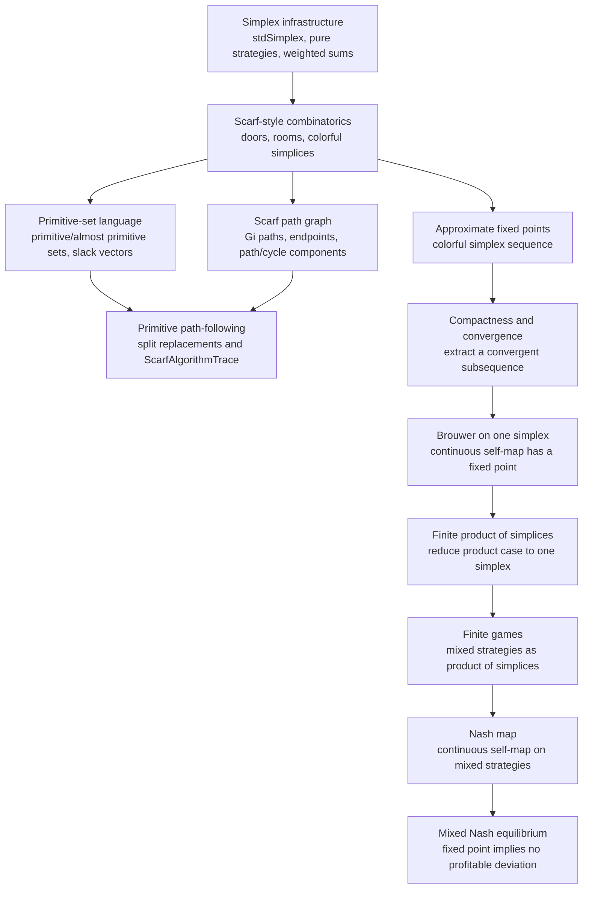

# Game Theory Formalization in Lean

This repository contains a formalization of fundamental theorems in game theory using the Lean proof assistant. The main goal is to prove the existence of Nash Equilibria in finite games.

## Lean Version

This project currently targets:

-   Lean `4.30.0`
-   mathlib `v4.30.0`

The Lean toolchain is pinned in `lean-toolchain`, and mathlib is pinned in `lakefile.lean` / `lake-manifest.json`.

## Building

Install Lean through `elan`, then run:

```bash
lake update
lake build
```

`lake update` resolves the pinned dependencies. `lake build` checks the full formalization.

## Core Concepts and Theorems

The proof of Nash's theorem relies on Brouwer's fixed-point theorem. This repository builds up the necessary mathematical framework from scratch.

## Proof Strategy Blueprint

The formalization follows this dependency chain:



In words:

1.  Define mixed strategies as points of standard simplices.
2.  Prove a Scarf/Sperner-style combinatorial lemma producing colorful simplices.
3.  Relate the room/door presentation to Scarf's primitive and almost-primitive sets on the enlarged set `T ∪ I`.
4.  Formalize the path-following graph `G_i`, including its degree characterization and path/cycle component structure.
5.  Connect primitive replacement steps to walks in `G_i`, yielding a complete trace from the boundary face `I - i` to a fully colored primitive set.
6.  Use finer and finer combinatorial approximations to build approximate fixed points.
7.  Use compactness to extract a convergent subsequence.
8.  Use continuity to turn the limit into an actual Brouwer fixed point.
9.  Lift the single-simplex fixed-point theorem to finite products of simplices.
10. Define the Nash map on mixed strategy profiles and apply the product fixed-point theorem.
11. Show that a fixed point of the Nash map satisfies the mixed Nash equilibrium condition.

### Files

-   `Gametheory/Simplex.lean`: Defines the standard simplex `stdSimplex` over a finite type. Includes constructors like `pure`, evaluation lemmas (`pure_eval_eq`, `pure_eval_neq`), and weighted-sum/typeclass instances needed later for continuity/compactness arguments.
-   `Gametheory/Scarf.lean`: Develops the combinatorial framework culminating in `Scarf`. Constructs the combinatorial objects (triangulations/labelings in the formalized guise) and proves existence of a "colorful" simplex, which is used to derive fixed points.
-   `Gametheory/Primitive.lean`: Recasts Scarf's room/door combinatorics in the paper's primitive-set language and connects that language back to the path graph `G_i`. Defines `ExtendedGoods`, `associatedCell`, `isPrimitive`, `isAlmostPrimitive`, `slackBoundary`, primitive replacement steps, split Scarf replacement steps, complete traces `ScarfAlgorithmTrace`, fully colored primitives, and coordinate-utility realizations. Key results include `isPrimitive_iff_native`, `isAlmostPrimitive_iff_native`, `almostPrimitive_incident_primitives_boundary_or_internal`, `scarfAlgorithmTrace_exists`, `scarf_fullyColoredPrimitive_exists`, and `coordinatePrimitive_erase_replacement_mainLemma`.
-   `Gametheory/ScarfPath.lean`: Formalizes the path-following graph `G_i` used in Scarf-style proofs. Defines `GiGraph`, `GiDegree`, `GiEndpoint`, proves the degree characterization `GiDegreeCharacterization_holds`, and packages the final component statement as `GiComponentStructure_holds`.
-   `Gametheory/Brouwer.lean`: From Scarf’s combinatorial lemma, proves Brouwer’s fixed-point theorem on a single simplex. Contains the main theorem `Brouwer` (existence of a fixed point for continuous self-maps on a simplex) and the supporting analytical lemmas (compactness, coordinate-wise continuity, convergence of constructed sequences).
-   `Gametheory/Brouwer_product.lean`: Lifts the single-simplex result to finite products of simplices. Defines helper conversions between a big simplex and a product of simplices (`BigSimplex`, `ProductSimplices`), constructs the projection/embedding, proves continuity properties, and states the product fixed-point theorem `Brouwer_Product`.
-   `Gametheory/Nash.lean`: Formalizes finite games `FinGame`, mixed strategies `mixedS`, payoffs, and mixed Nash equilibrium `mixedNashEquilibrium`. Builds a continuous `nash_map` on the product of simplices and applies `Brouwer_Product` to obtain existence: `ExistsNashEq : ∃ σ : G.mixedS, mixedNashEquilibrium σ`.
-   `GameTheory.lean`: Umbrella file that imports `Brouwer`, `Nash`, and `Simplex` for convenience.

Open any of the Lean files in an editor with the Lean server running to see goals and check proofs interactively.

## Notation and Key Definitions

-   `stdSimplex ℝ α`: the standard simplex over a finite type `α` with real coefficients.
-   `ExtendedGoods T I`: the enlarged set `T ∪ I`, represented as `Sum T I`, used for Scarf's slack-vector language.
-   `associatedCell X`: the room/door cell `(X ∩ T, I \ X)` associated to a subset of `T ∪ I`.
-   `isPrimitive` / `isAlmostPrimitive`: native primitive and almost-primitive sets, equivalent to the existing room/door presentation.
-   `slackBoundary i`: the boundary almost-primitive face `I - i`.
-   `primitiveReplacementStep`: the primitive-set replacement relation obtained by passing through a common almost-primitive face.
-   `scarfSplitReplacementStep`: the split form `X → Y → X'` of Scarf's replacement algorithm, where `Y` is almost primitive.
-   `ScarfAlgorithmTrace`: a primitive-language walk in `G_i` from `I - i` to a fully colored primitive set.
-   `GiGraph`, `GiDegree`, `GiEndpoint`: the graph-theoretic path-following objects for a fixed color `i`.
-   `GiComponentStructure_holds`: theorem stating that the components of `G_i` are paths or cycles, with endpoints exactly the outside door of type `i` and the colorful rooms.
-   `scarfAlgorithmTrace_exists`: theorem constructing a complete primitive-language Scarf trace.
-   `Brouwer_Product`: theorem providing a fixed point on a finite product of simplices.
-   `FinGame`: structure for finite games (finite players and finite pure strategy sets).
-   `mixedS`: type of mixed strategy profiles for a `FinGame`.
-   `mixedNashEquilibrium σ`: predicate that `σ : G.mixedS` is a mixed Nash equilibrium.
-   `ExistsNashEq`: existence theorem for mixed Nash equilibria.

## References

-   N. V. Ivanov, "Beyond Sperner's Lemma" (source of the Scarf → Brouwer development).
-   J. F. Nash, "Non-Cooperative Games", Annals of Mathematics (1951).
