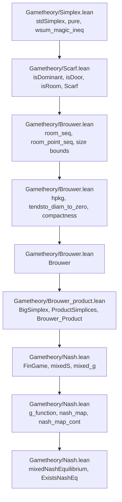

# Game Theory Formalization in Lean

This repository contains a formalization of fundamental theorems in game theory using the Lean proof assistant. The main goal is to prove the existence of Nash Equilibria in finite games.

## Lean Version

This project currently targets:

-   Lean `4.30.0`
-   mathlib `v4.30.0`

The Lean toolchain is pinned in `lean-toolchain`, and mathlib is pinned in `lakefile.lean` / `lake-manifest.json`.

## Building

Install Lean through `elan`, then run:

```bash
lake update
lake build
```

`lake update` resolves the pinned dependencies. `lake build` checks the full formalization.

## Core Concepts and Theorems

The proof of Nash's theorem relies on Brouwer's fixed-point theorem. This repository builds up the necessary mathematical framework from scratch.

## Proof Strategy Blueprint

The formalization follows this dependency chain:



The main proof obligations at each stage are:

1.  `Simplex.lean` packages mixed strategies as points of `stdSimplex` and proves basic algebraic facts about pure strategies and weighted sums.
2.  `Scarf.lean` builds the combinatorial language of dominance, doors, rooms, and colorful simplices, ending in the Scarf-style existence result.
3.  `Brouwer.lean` turns the colorful simplices into a sequence of approximate fixed points, with coordinate diameter bounds.
4.  `Brouwer.lean` uses compactness to extract a convergent subsequence and continuity to pass from approximate fixed points to a genuine fixed point.
5.  `Brouwer_product.lean` encodes a finite product of simplices as one big simplex, proves the required projection/embedding continuity, and derives `Brouwer_Product`.
6.  `Nash.lean` represents finite games by `FinGame`, mixed strategy profiles by `mixedS`, and payoffs by `mixed_g`.
7.  `Nash.lean` defines the continuous self-map `nash_map` on mixed strategies.
8.  A fixed point of `nash_map` is shown to satisfy `mixedNashEquilibrium`, yielding `ExistsNashEq`.

### Files

-   `Gametheory/Simplex.lean`: Defines the standard simplex `stdSimplex` over a finite type. Includes constructors like `pure`, evaluation lemmas (`pure_eval_eq`, `pure_eval_neq`), and weighted-sum/typeclass instances needed later for continuity/compactness arguments.
-   `Gametheory/Scarf.lean`: Develops the combinatorial framework culminating in `Scarf`. Constructs the combinatorial objects (triangulations/labelings in the formalized guise) and proves existence of a "colorful" simplex, which is used to derive fixed points.
-   `Gametheory/Brouwer.lean`: From Scarf’s combinatorial lemma, proves Brouwer’s fixed-point theorem on a single simplex. Contains the main theorem `Brouwer` (existence of a fixed point for continuous self-maps on a simplex) and the supporting analytical lemmas (compactness, coordinate-wise continuity, convergence of constructed sequences).
-   `Gametheory/Brouwer_product.lean`: Lifts the single-simplex result to finite products of simplices. Defines helper conversions between a big simplex and a product of simplices (`BigSimplex`, `ProductSimplices`), constructs the projection/embedding, proves continuity properties, and states the product fixed-point theorem `Brouwer_Product`.
-   `Gametheory/Nash.lean`: Formalizes finite games `FinGame`, mixed strategies `mixedS`, payoffs, and mixed Nash equilibrium `mixedNashEquilibrium`. Builds a continuous `nash_map` on the product of simplices and applies `Brouwer_Product` to obtain existence: `ExistsNashEq : ∃ σ : G.mixedS, mixedNashEquilibrium σ`.
-   `GameTheory.lean`: Umbrella file that imports `Brouwer`, `Nash`, and `Simplex` for convenience.

Open any of the Lean files in an editor with the Lean server running to see goals and check proofs interactively.

## Notation and Key Definitions

-   `stdSimplex ℝ α`: the standard simplex over a finite type `α` with real coefficients.
-   `Brouwer_Product`: theorem providing a fixed point on a finite product of simplices.
-   `FinGame`: structure for finite games (finite players and finite pure strategy sets).
-   `mixedS`: type of mixed strategy profiles for a `FinGame`.
-   `mixedNashEquilibrium σ`: predicate that `σ : G.mixedS` is a mixed Nash equilibrium.
-   `ExistsNashEq`: existence theorem for mixed Nash equilibria.

## References

-   N. V. Ivanov, "Beyond Sperner's Lemma" (source of the Scarf → Brouwer development).
-   J. F. Nash, "Non-Cooperative Games", Annals of Mathematics (1951).
