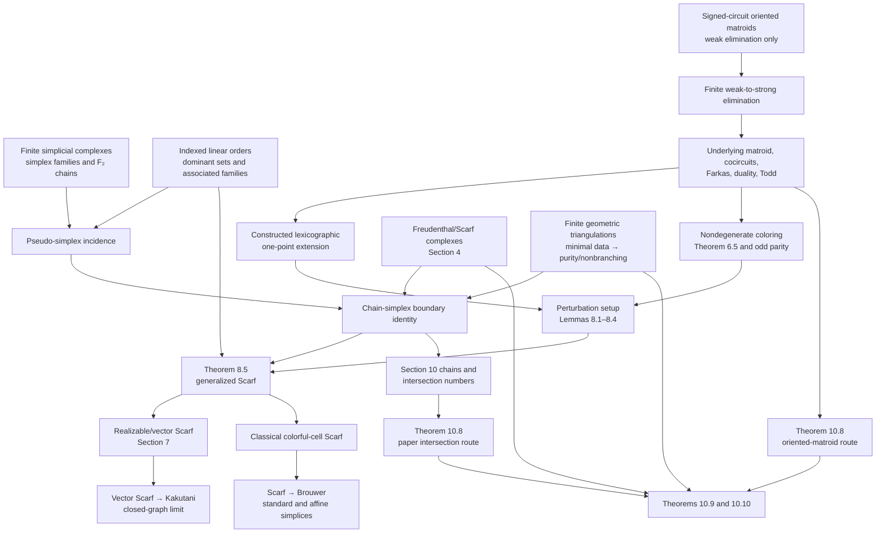

# Brouwer, Nash, and Scarf in Lean

This repository contains two independent Lean developments:

- `Gametheory`: a Scarf-style proof of Brouwer's fixed-point theorem followed by existence of
  mixed Nash equilibria for finite games.
- `BeyondSperner`: a formalization of the main dependency spine and applications in Nikolai
  Ivanov's *Scarf's theorems, simplices, and oriented matroids* (arXiv:2207.10832).

The project uses Lean `4.33.0` and mathlib `v4.33.0`, pinned by `lean-toolchain` and
`lake-manifest.json`.

## Verified status

The `BeyondSperner` development is proof-complete within the scope stated below.

- `lake build` succeeds with no Lean errors or warnings.
- There are no `sorry`, `admit`, declared project axioms, or unsafe theorem substitutes in the
  mathematical source tree.
- The exhaustive audit checks all 3660 declarations in the `BeyondSperner` namespace, including
  generated declarations and the compatibility adapters.  No declaration depends on `sorryAx`
  or on a nonstandard axiom.
- The only axioms appearing in transitive closures are Lean's standard `propext`,
  `Classical.choice`, and `Quot.sound`.

Reproduce the build and both levels of axiom audit with:

```bash
lake build
lake env lean FormalizationInterface/AuditAll.lean
lake env lean FormalizationInterface/Audit.lean
```

`AuditAll.lean` is the exhaustive pass and fails on any forbidden dependency. `Audit.lean` prints
the axiom closures of representative public declarations so that the important theorem routes are
easy to inspect by hand.

## Formalization blueprint

The diagram separates the common combinatorial spine, the perturbation route to generalized
Scarf, and the principal applications.  An arrow means theorem dependency, not merely conceptual
similarity.


```mermaid
flowchart TD
    SC["Finite simplicial complexes<br/>simplex families and F₂ chains"]
    PS["Pseudo-simplex incidence"]
    CS["Chain-simplex boundary identity"]
    OR["Indexed linear orders<br/>dominant sets and associated families"]

    OM["Signed-circuit oriented matroids<br/>weak elimination only"]
    WS["Finite weak-to-strong elimination"]
    DU["Underlying matroid, cocircuits,<br/>Farkas, duality, Todd"]
    LX["Constructed lexicographic<br/>one-point extension"]

    ND["Nondegenerate coloring<br/>Theorem 6.5 and odd parity"]
    PT["Perturbation setup<br/>Lemmas 8.1–8.4"]
    GS["Theorem 8.5<br/>generalized Scarf"]

    VS["Realizable/vector Scarf<br/>Section 7"]
    CL["Classical colorful-cell Scarf"]
    BR["Scarf → Brouwer<br/>standard and affine simplices"]
    KA["Vector Scarf → Kakutani<br/>closed-graph limit"]

    CH["Section 10 chains and<br/>intersection numbers"]
    T8A["Theorem 10.8<br/>paper intersection route"]
    T8B["Theorem 10.8<br/>oriented-matroid route"]
    T910["Theorems 10.9 and 10.10"]

    FR["Freudenthal/Scarf complexes<br/>Section 4"]
    GT["Finite geometric triangulations<br/>minimal data → purity/nonbranching"]

    SC --> PS --> CS
    OR --> PS
    OM --> WS --> DU --> LX
    DU --> ND
    LX --> PT
    ND --> PT --> GS
    CS --> GS
    OR --> GS

    GS --> VS --> KA
    GS --> CL --> BR

    CS --> CH --> T8A --> T910
    DU --> T8B --> T910
    FR --> CS
    FR --> T910
    GT --> CS
    GT --> T910
```

The two Theorem 10.8 nodes are genuinely dependency-independent.  The forward intersection route
does not import the oriented-matroid theorem; adapters in `FormalizationInterface` feed either
provider into the common Theorem 10.9 and 10.10 layers.

## Main checked conclusions

The public development includes:

- weak-to-strong elimination for finite signed-circuit oriented matroids, constructed duality,
  cocircuit elimination, Farkas/four-painting alternatives, and Todd elimination;
- a constructed lexicographic extension, rather than an axiom or a wrapper around the existence
  theorem cited by the paper;
- Theorem 6.5 with its odd-parity conclusion, Lemmas 8.1–8.4, Theorem 8.5, and
  `GeneralizedScarf.generalizedScarf`;
- the realizable/vector form of Scarf's theorem, the classical colorful-cell specialization,
  Brouwer on finite standard and affine simplices, and Kakutani for closed-graph nonempty
  convex-valued correspondences on a finite standard simplex;
- the Section 4 Freudenthal/Scarf complex comparison, boundary formulas, Theorem 4.8, and the
  stated positive-scale corollaries;
- the Section 10 `F₂` chain and intersection-number route through Theorems 10.8–10.10, alongside
  the independent oriented-matroid proof of Theorem 10.8;
- applications of Theorems 10.9 and 10.10 both to the concrete positive-scale Freudenthal
  triangulation and to arbitrary finite geometric triangulations.

The detailed paper-to-Lean declaration table is in
[`FormalizationInterface/BeyondSperner.md`](FormalizationInterface/BeyondSperner.md).  The longer
completion report and proof-architecture notes are in
[`FormalizationInterface/STATUS.md`](FormalizationInterface/STATUS.md).

## Semantic audit: exact statements and necessary repairs

The audit did not treat matching theorem names as sufficient.  Definitions and hypotheses were
compared with the paper, and the following boundary decisions are intentional.

| Paper-facing item | Lean contract | Reason |
| --- | --- | --- |
| Dimension of `D(A)` | `SimplexFamily.dimension` stores `|σ| ≤ |A|`; top simplices and purity are separate predicates | Exact dimension is false for arbitrary order families: two identical orders on two points need not have a two-element cell.  Every later argument that needs a top simplex or purity proves or assumes it explicitly. |
| Oriented-matroid elimination | `OrientedMatroid.Data` stores weak elimination only; strong elimination is derived for finite ground types | This avoids strengthening the primitive structure with the optional extra axiom mentioned in the paper. |
| Lemma 6.1 | The Lean theorem explicitly assumes `b ∉ X` | Convex-hull membership includes ordinary membership, so the unrestricted printed surface statement would be false. |
| Lemma 6.3 | The statement carries the used top-cardinality hypothesis | Dropping the top-dimensional context gives an over-strong claim for arbitrary finite sets. |
| Lemma 7.3 | `[Nonempty X]` is explicit | The empty old ground set gives a concrete counterexample under the paper's dominance convention. |
| Raw vector Scarf | `old_ne_b`, `b_ne_basis`, and boundedness of the nonnegative solution set are explicit | These are the exclusions and boundedness needed when the paper applies Theorem 7.2 to its displayed raw map `φ`. |
| Section 9 finite samples | The exact-fixed-point branch is restored before the cell branch | A selected color equal to `b` is already `f(x)=x`; suppressing this branch would overstate the finite lemma. |
| Lemma 10.2 | The formal theorem assumes `0 < n`, and proves a dimension-zero counterexample to the unrestricted reading | In dimension zero there is no one-simplex endpoint perturbation of the required kind. |
| Theorem 10.10 | The abstract theorem exposes face compatibility, ambient inclusion, and purity | These are properties of a triangulation, not consequences of `SimplexFamily` or `IsChainSimplex` alone.  Concrete Freudenthal and geometric applications discharge them. |
| Geometric triangulation input | Stores only a geometric simplicial complex, finite vertices, and exact coverage | Purity and local one-or-two coface incidence are derived, so the desired conclusion is not hidden in the input data. |

These changes make implicit necessary context explicit or weaken an inconsistent base definition;
they do not strengthen the advertised conclusions.  Alternative proof architecture is also
recorded honestly: the checked Section 7 theorem factors through the stronger oriented-matroid
Theorem 8.5 instead of reproducing the paper's sequential perturbation proof.

## Trust boundary and non-goals

- The source paper is the mathematical specification, but this repository does not claim that
  every sentence or every possible generalization in the paper has been formalized.
- Brouwer is proved here for finite standard simplices and convex hulls of finite affine bases,
  not for every nonempty compact convex subset of an arbitrary finite-dimensional space.
- `Rethlas/` contains preserved informal audit material.  It is not imported by Lean and is not
  counted as proof evidence; the corresponding published results are independently kernel-checked.
- Classical choice, quotient soundness, and propositional extensionality are part of the declared
  Lean trust boundary.  No project-specific mathematical axiom is added.
- `Gametheory` remains independent of `BeyondSperner`; the two developments should not be read as
  secretly proving one another's central steps.

## Source layout

- [`BeyondSperner.lean`](BeyondSperner.lean): umbrella import for the mathematical development.
- [`BeyondSperner/OrientedMatroid`](BeyondSperner/OrientedMatroid): signed circuits, ordinary
  matroid recovery, cocircuits, duality, realizability, and lexicographic extension.
- [`BeyondSperner/Simplicial`](BeyondSperner/Simplicial) and
  [`BeyondSperner/Orders`](BeyondSperner/Orders): simplex families, chains, envelopes, dominance,
  cells, and associated families.
- [`BeyondSperner/Coloring`](BeyondSperner/Coloring) and
  [`BeyondSperner/Scarf`](BeyondSperner/Scarf): nondegenerate/general coloring theorems and the
  generalized, classical, and vector Scarf conclusions.
- [`BeyondSperner/FixedPoint`](BeyondSperner/FixedPoint): Scarf routes to Brouwer and Kakutani.
- [`BeyondSperner/Freudenthal`](BeyondSperner/Freudenthal): the Section 4 arithmetic, complexes,
  boundary induction, geometry, and applications.
- [`BeyondSperner/Euclidean`](BeyondSperner/Euclidean): Section 10 chains, general position,
  intersection numbers, and the paper route to affine coloring.
- [`BeyondSperner/Geometry/Triangulation`](BeyondSperner/Geometry/Triangulation): construction and
  applications of arbitrary finite geometric triangulations.
- [`FormalizationInterface`](FormalizationInterface): theorem-route adapters, semantic contracts,
  status documents, and executable audits.
- [`Gametheory`](Gametheory): the separate Brouwer/Nash development.

## Development rule

Any change to a definition, structure field, or theorem hypothesis requires a semantic review
against the paper and the downstream use sites.  A successful build alone is not enough: run the
exhaustive axiom audit as part of the same change.
