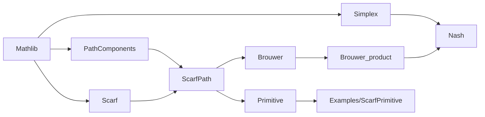

# 仓库结构与模块关系

## 顶层结构

```text
.
├── GameTheory.lean              # 默认 umbrella 入口
├── Gametheory/                  # Lean 证明源码
│   ├── Simplex.lean
│   ├── Scarf.lean
│   ├── PathComponents.lean
│   ├── Examples/ScarfPrimitive.lean
│   ├── ScarfPath.lean
│   ├── Primitive.lean
│   ├── Brouwer.lean
│   ├── Brouwer_product.lean
│   ├── Nash.lean
│   └── AxiomAudit.lean
├── lakefile.lean                # Lake 包与默认 lean_lib 配置
├── lake-manifest.json           # 完整依赖锁定清单
├── lean-toolchain               # Lean 版本固定点
├── README.md                    # 项目总览与数学证明蓝图
├── Beyond Sperner's lemma.pdf   # 仓库内的参考文献 PDF
├── LICENSE                      # MIT License
├── .github/workflows/lean.yml   # 当前工作区中的 Lean CI 配置
└── .lake/                       # Lake 依赖和构建缓存（见下方说明）
```

当前工作区还包含 `paper/`、`output/` 和 `tmp/`。探索时它们在 `git status` 中是未跟踪内容，属于论文草稿、生成 PDF 和渲染中间产物；不能假定它们存在于每个克隆中，也不应把它们当成 Lean 库的构建输入。`paper/cpp2027/README.md` 记录了该论文草稿自己的构建方法。

`.lake/` 在 `.gitignore` 中，但当前 Git 索引仍记录了一批历史构建产物。对新贡献者而言，应把它视为 Lake 管理的依赖/缓存目录，不要手工编辑其中的 `.olean`、`.ilean`、`.c`、`.trace` 或包目录。

## Lake 入口

`lakefile.lean` 定义：

```lean
@[default_target]
lean_lib «Gametheory» {
  roots := #[`GameTheory]
  globs := #[.one `GameTheory, .submodules `Gametheory]
}
```

因此 `lake build` 的默认库显式构建 `GameTheory.lean`，并包含
`Gametheory` 的全部子模块。`GameTheory.lean` 本身只负责导入全部证明模块和
`AxiomAudit`，不包含额外定义。

## 实际导入图

下面按源码中的 `import` 语句绘制，而不是按论文叙事顺序推测：



`AxiomAudit.lean` 直接导入原有七个模块；通用图论模块经 `ScarfPath` 导入。`GameTheory.lean` 导入原有七个模块和 `AxiomAudit`。示例模块由 Lake 的子模块 glob 纳入默认构建。

一个容易混淆的区别是：

- 主要 Nash 编译链是 `Scarf → ScarfPath → Brouwer → Brouwer_product → Nash`，同时 `Nash` 导入 `Simplex`。
- `ScarfPath` 和 `Primitive` 提供固定颜色路径图、primitive 替换轨迹及其坐标实现，是项目的重要结构化扩展。
- 按当前导入关系，`Nash.lean` 经 `Brouwer` 间接导入 `ScarfPath`，但没有调用其路径端点；`Primitive` 由 umbrella 入口纳入构建和审计。模块导入依赖不等于定理证明依赖。

## 模块职责

| 模块 | 直接项目内导入 | 职责与代表性端点 |
| --- | --- | --- |
| `Simplex.lean` | 无（导入 `Mathlib`） | 为 `stdSimplex` 补充 `FunLike`/`Inhabited` 实例、纯策略 `pure`、求值引理和加权和不等式 `wsum_magic_ineq`。 |
| `Scarf.lean` | 无（导入 `Mathlib`） | 定义 `IndexedLOrder`、dominant cell、room/door、colorful 等组合对象；端点 `IndexedLOrder.Scarf` 给出 colorful cell 的存在性。 |
| `PathComponents.lean` | 无（导入 `Mathlib`） | `PathComponents` 命名空间中的通用 `SimpleGraph` spanning path/cycle 与 reachable component 结果。 |
| `Examples/ScarfPrimitive.lean` | `Primitive` | 参数推断、dot notation、编码化简及轨迹调用示例。 |
| `ScarfPath.lean` | `Scarf`, `PathComponents` | 定义 `ScarfPath.Cell`、`ScarfPath.graph`、`ScarfPath.degree`、`ScarfPath.IsEndpoint`；`ScarfPath.degree_characterization` 与 `ScarfPath.component_structure` 描述固定颜色图的度数和路径/环分量。 |
| `Primitive.lean` | `ScarfPath` | 在 `Primitive.ExtendedGoods = Sum T I` 上连接 room/door 与 primitive/almost-primitive 表述，构造 replacement step、`Primitive.Trace` 和坐标效用模型；代表性端点包括 `Primitive.isRoomPrimitive_iff_isPrimitive`、`Primitive.Trace.nonempty`、`Primitive.Coordinate.exists_model`。 |
| `Brouwer.lean` | `ScarfPath` | 用离散网格、colorful rooms、子序列与紧致性证明标准单纯形上的 `Brouwer`：连续自映射存在不动点。 |
| `Brouwer_product.lean` | `Brouwer` | 在大单纯形与单纯形乘积间构造投影/嵌入，并用 retract 思路得到 `Brouwer_Product`。 |
| `Nash.lean` | `Brouwer_product`, `Simplex` | 定义 `Game`、`FinGame`、`mixedS`、`mixed_g`、`mixedNashEquilibrium` 和连续 `nash_map`；端点 `ExistsNashEq` 证明有限博弈存在混合 Nash 均衡。 |
| `AxiomAudit.lean` | 全部七个模块 | 使用 `#print axioms` 输出主要有限组合、图、primitive、Brouwer、乘积和 Nash 端点所依赖的公理。 |

## 数学主线

项目根 `README.md` 给出的主线可压缩为：

1. 在越来越细的有限网格上使用 Scarf 风格的 colorful cell 存在性。
2. 从网格构造近似不动点，并用紧致性抽取收敛子序列。
3. 由连续性把极限升级为标准单纯形上的 Brouwer 不动点。
4. 通过大单纯形与有限单纯形乘积之间的 retract 得到乘积版本。
5. 把有限博弈的混合策略空间表示成单纯形乘积，为 Nash 映射取不动点，再证明该点满足无有利单边偏离条件。

`ScarfPath.lean`/`Primitive.lean` 进一步形式化 room-door 图的路径结构和替换语言；这些路径/轨迹定理没有用作 `Brouwer` 或 `Nash` 证明的前提。

## 命名与导航提示

- 目录名与 Lake 库名是 `Gametheory`，但 umbrella 文件名是 `GameTheory.lean`，大小写不同；在区分大小写的文件系统上必须使用原样拼写。
- 基础 room/door 组合结果位于 `IndexedLOrder`；路径图接口位于 `ScarfPath`，primitive/trace 接口位于 `Primitive`，坐标实现位于 `Primitive.Coordinate`。用法及旧名迁移见 [接口导览](scarf-primitive.md)。
- `Brouwer.ProductRetraction` 是一个 section 名称，不会给声明添加命名空间；乘积定理的名称是 `Brouwer_Product`。
- `FinGame` 相关定义多数位于 `FinGame` 命名空间；`ExistsNashEq` 在源码末段定义。
- 查找声明时可用：

  ```sh
  rg -n '^(theorem|lemma|def|structure|abbrev) ' Gametheory
  ```

- 查看真正的模块边界时优先检查文件开头的 `import`，不要只依赖概念图。
