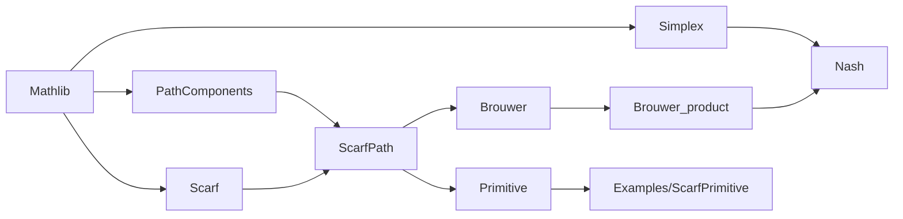

# Repository Structure and Module Relationships

## Top-level layout

```text
.
├── GameTheory.lean              # Default umbrella entry point
├── Gametheory/                  # Lean proof sources
│   ├── Simplex.lean
│   ├── Scarf.lean
│   ├── PathComponents.lean
│   ├── Examples/ScarfPrimitive.lean
│   ├── ScarfPath.lean
│   ├── Primitive.lean
│   ├── Brouwer.lean
│   ├── Brouwer_product.lean
│   ├── Nash.lean
│   └── AxiomAudit.lean
├── lakefile.lean                # Lake package and default lean_lib configuration
├── lake-manifest.json           # Complete dependency lockfile
├── lean-toolchain               # Pinned Lean version
├── README.md                    # Project overview and mathematical blueprint
├── Beyond Sperner's lemma.pdf   # Reference paper included in the repository
├── LICENSE                      # MIT License
├── .github/workflows/lean.yml   # Lean CI configuration
└── .lake/                       # Lake dependencies and build cache (see below)
```

The workspace inspected for this guide also contained `paper/`, `output/`, and `tmp/`. At that time, these were untracked manuscript drafts, generated PDFs, and rendering intermediates. They may be absent from other clones and are not inputs to the Lean library build. `paper/cpp2027/README.md` documents the manuscript's own build procedure.

Although `.lake/` appears in `.gitignore`, the Git index still contains some historical build artifacts. Contributors should treat it as a Lake-managed dependency and cache directory; do not manually edit its `.olean`, `.ilean`, `.c`, `.trace`, or package files.

## Lake entry point

`lakefile.lean` defines:

```lean
@[default_target]
lean_lib «Gametheory» {
  roots := #[`GameTheory]
  globs := #[.one `GameTheory, .submodules `Gametheory]
}
```

The default library target of `lake build` therefore explicitly builds `GameTheory.lean` and includes all `Gametheory` submodules. `GameTheory.lean` imports the proof modules and `AxiomAudit` without adding definitions.

## Actual import graph

This diagram follows the source `import` statements, rather than the manuscript's narrative order:



`AxiomAudit.lean` directly imports the original seven modules; the general graph module is imported through `ScarfPath`. `GameTheory.lean` imports those seven modules and `AxiomAudit`. Lake's submodule glob includes the example module in the default build.

Keep these distinctions in mind:

- The main Nash compilation chain is `Scarf → ScarfPath → Brouwer → Brouwer_product → Nash`; `Nash` also imports `Simplex`.
- `ScarfPath` and `Primitive` provide the fixed-color path graph, primitive replacement traces, and coordinate realizations as structural extensions of the project.
- Under the current imports, `Nash.lean` indirectly imports `ScarfPath` through `Brouwer` but does not invoke its path endpoints. The umbrella entry point includes `Primitive` in the build and audit. Module imports and theorem dependencies are different relationships.

## Module responsibilities

| Module | Direct project imports | Responsibility and representative endpoints |
| --- | --- | --- |
| `Simplex.lean` | None (imports `Mathlib`) | Adds `FunLike`/`Inhabited` instances for `stdSimplex`, pure strategies `pure`, evaluation lemmas, and the weighted-sum inequality `wsum_magic_ineq`. |
| `Scarf.lean` | None (imports `Mathlib`) | Defines `IndexedLOrder`, dominant cells, rooms/doors, and colorful combinatorial objects; `IndexedLOrder.Scarf` establishes the existence of a colorful cell. |
| `PathComponents.lean` | None (imports `Mathlib`) | General `SimpleGraph` results on spanning paths/cycles and reachable components in the `PathComponents` namespace. |
| `Examples/ScarfPrimitive.lean` | `Primitive` | Examples of parameter inference, dot notation, encoding simplification, and trace calls. |
| `ScarfPath.lean` | `Scarf`, `PathComponents` | Defines `ScarfPath.Cell`, `ScarfPath.graph`, `ScarfPath.degree`, and `ScarfPath.IsEndpoint`; `ScarfPath.degree_characterization` and `ScarfPath.component_structure` describe degrees and path/cycle components of the fixed-color graph. |
| `Primitive.lean` | `ScarfPath` | Connects room/door and primitive/almost-primitive formulations over `Primitive.ExtendedGoods = Sum T I`; constructs replacement steps, `Primitive.Trace`, and coordinate utility models. Representative endpoints include `Primitive.isRoomPrimitive_iff_isPrimitive`, `Primitive.Trace.nonempty`, and `Primitive.Coordinate.exists_model`. |
| `Brouwer.lean` | `ScarfPath` | Uses discrete grids, colorful rooms, subsequences, and compactness to prove `Brouwer` on the standard simplex: every continuous self-map has a fixed point. |
| `Brouwer_product.lean` | `Brouwer` | Constructs a projection and embedding between a large simplex and a product of simplices, then obtains `Brouwer_Product` through a retraction. |
| `Nash.lean` | `Brouwer_product`, `Simplex` | Defines `Game`, `FinGame`, `mixedS`, `mixed_g`, `mixedNashEquilibrium`, and the continuous `nash_map`; `ExistsNashEq` proves that a finite game has a mixed Nash equilibrium. |
| `AxiomAudit.lean` | All seven original modules | Uses `#print axioms` to report the axioms of the main finite combinatorial, graph, primitive, Brouwer, product, and Nash endpoints. |

## Main mathematical route

The route described in the root `README.md` can be summarized as follows:

1. Apply Scarf-style colorful-cell existence on increasingly fine finite grids.
2. Construct approximate fixed points from the grids and use compactness to extract a convergent subsequence.
3. Use continuity to obtain a Brouwer fixed point on the standard simplex at the limit.
4. Obtain the product version through a retraction between a large simplex and a finite product of simplices.
5. Represent a finite game's mixed-strategy space as a product of simplices, obtain a fixed point of the Nash map, and prove that no unilateral deviation is profitable.

`ScarfPath.lean` and `Primitive.lean` additionally formalize the path structure of the room-door graph and the replacement formulation. These path/trace theorems are not premises of the `Brouwer` or `Nash` proofs.

## Naming and navigation

- The directory and Lake library are named `Gametheory`, but the umbrella file is `GameTheory.lean`. Preserve this capitalization on case-sensitive filesystems.
- Basic room/door combinatorics lives in `IndexedLOrder`; the path graph interface is in `ScarfPath`, primitive/trace interfaces in `Primitive`, and coordinate realizations in `Primitive.Coordinate`. See the [interface guide](scarf-primitive.md) for usage and migration from old names.
- `Brouwer.ProductRetraction` is a section name and does not add a namespace to declarations; the product theorem is named `Brouwer_Product`.
- Most definitions related to `FinGame` are in the `FinGame` namespace; `ExistsNashEq` is defined near the end of the source file.
- To find declarations, use:

  ```sh
  rg -n '^(theorem|lemma|def|structure|abbrev) ' Gametheory
  ```

- To inspect actual module boundaries, check each file's initial `import` statements rather than relying solely on a conceptual diagram.
